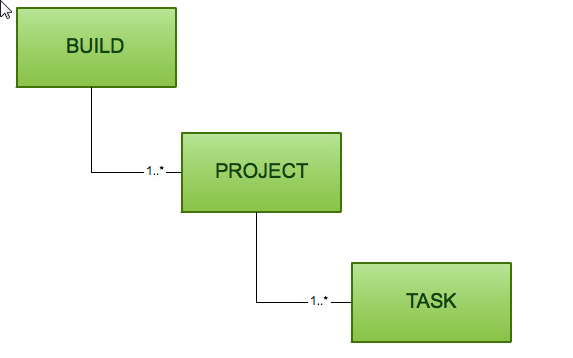

# Gradle 学习

##Gradle 介绍
项目(Project) 和 任务(tasks)，Gradle 里的任何东西都是基于这两个基础概念。

* 项目是指我们的构建产物（比如Jar包）或实施产物（将应用程序部署到生产环境）。
* 任务是指不可分的最小工作单元，执行构建工作（比如编译项目或执行测试）。
* 每一个构建都是由一个或多个 projects 构成的，每一个 project 是由一个或多个 tasks 构成的，一个 task是指不可分的最小工作单元，执行构建工作



## Gradle 文件构成

* build.gradle 我们称这个文件为一个构建脚本，这个脚本定义了一个模块和编译用的tasks，它一般是放在项目的模块中，也可以放在项目的根目录用来作为编译结构全局设置，它是必须的
* settings.gradle 它描述了哪一个模块需要参与构建。每一个多模块的构建都必须在项目结构的根目录中加入这个设置文件，它也是必须的
* gradle.properties 用来配置构建属性

## Task

* 使用 vim 在本地新建一个 build 文件，输入以下内容。

```
task hello {
    println 'halo'
}
```

*  使用命令 `gradle hello`运行，得到结果

```

> Configure project :
halo

BUILD SUCCESSFUL in 0s
```
以上就实习了一个简单 Task 的编写和运行过程。

### Task 依赖

```
task hello {
    println 'halo'
}
task sayHello(dependsOn: hello) {
    println 'say hello'
}
```

*  使用命令 `gradle hello`运行，得到结果

```
> Configure project :
halo
say hello

BUILD SUCCESSFUL in 0s
```
被依赖的 Task 会先于当前任务执行。

## Gradle 插件

1. gradle build：编译整个项目，它会执行代码编译、代码检测和单元测试等
2. gradle assemble：编译并打包你的代码, 但是并不运行代码检测和单元测试
3. gradle clean：删除 build 生成的目录和所有生成的文件
4. gradle check：编译并测试你的代码


如图，这些指令本质上也是一些 Task 的指令的集合。
### 外部依赖
项目在引用外部的资源文件时，需要指定对应引用的仓库地址。
```
repositories {
	mavenCentral()
	jCentral()
}
```
之后再添加对于依赖

```
dependencies {
	compile group: 'commons-collections', name: 'commons-collections', version: '3.2'
	// 简化写法
	// compile 'commons-collections:commons-collections:3.2'
}
```

### 插件中的标准配置

1. `compile` 用来编译项目源代码的依赖
2. `runtime` 在运行时被生成的类使用的依赖，默认的包含了 `compile` 时的依赖
3. `testCompile` 编译测试代码的依赖，默认包含以上两种依赖
4. `testRuntime` 运行测试所需要的依赖，默认包含上面三种依赖