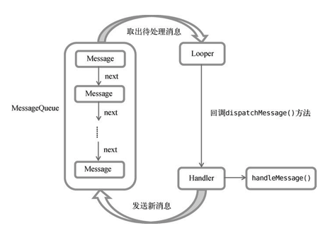

# Android 异步的消息处理机制

* Message
Message 是在线程之间传递的消息，它可以在内部携带少量的信息，用于在不同线程之间交换数据。我们根据它携带的数据得到了一些信息：

``` java
    // Message 标识符
    public int what;
    // Message 所携带的信息
    public int arg1;
    public int arg2;
    public Object obj;

    /*package*/ int flags;
    /*package*/ long when;
    /*package*/ Bundle data;
    // 对应的 handle
    /*package*/ Handler target;
    // 回调
    /*package*/ Runnable callback;
    // sometimes we store linked lists of these things
    // 链表的下一个节点
    /*package*/ Message next;
    // 链表表头
    private static Message sPool;
    // 链表容量
    private static int sPoolSize = 0;
    // 链表读写锁
    private static final Object sPoolSync = new Object();

```

Message 内部使用 `obtain()` 方法和 `recyclerUnchecked()` 方法维护了一个 Pool（本质上是一个链表） 来回收和复用 Message 对象。具体的源码如下

``` java

 public static Message obtain() {
        synchronized (sPoolSync) {
            if (sPool != null) { //链表不为空时复用
                Message m = sPool;
                sPool = m.next;
                m.next = null;
                m.flags = 0; // clear in-use flag
                sPoolSize--;
                return m;
            }
        }
        // 不可复用时直接 alloc
        return new Message();
    }
    
    void recycleUnchecked() {
        // Mark the message as in use while it remains in the recycled object pool.
        // Clear out all other details. 
        // 清空数据
        flags = FLAG_IN_USE;
        what = 0;
        arg1 = 0;
        arg2 = 0;
        obj = null;
        replyTo = null;
        sendingUid = -1;
        when = 0;
        target = null;
        callback = null;
        data = null;

        synchronized (sPoolSync) {
        //插入链表
            if (sPoolSize < MAX_POOL_SIZE) {
                next = sPool;
                sPool = this;
                sPoolSize++;
            }
        }
    }
```


* Looper
Looper 是每个线程中的 MessageQueue 的管家，调用Looper的`loop()`方法后，就会进入到一个无限循环当中，然后每当发现 MessageQueue 中存在一条消息，就会将它取出，并传递到 Handler 的`handleMessage()`方法中。每个线程中也只会有一个Looper对象。

在查看 Looper 源码之前，我们需要先了解 ThreadLocal，这对我们了解 Looper 有非常大的帮助。

> [并发(2) -- synchronized 与 Lock](https://www.jianshu.com/p/1b01ea782a9b)
> [带你了解源码中的 ThreadLocal](https://www.jianshu.com/p/4167d7ff5ec1)

最简单的解释的话，ThreadLocal （线程本地储存）可以使用相同变量在每个不同的线程都创建不同的存储。有了这个知识储备之后，我们再一窥 Looper 的源码：

```java

   // sThreadLocal.get() will return null unless you've called prepare().
    static final ThreadLocal<Looper> sThreadLocal = new ThreadLocal<Looper>();
    private static Looper sMainLooper;  // guarded by Looper.class
    final MessageQueue mQueue;
    final Thread mThread;
    
    ...
    
        /* If set, the looper will show a warning log if a message dispatch takes longer than time. */
    private long mSlowDispatchThresholdMs;
```
在了解主要的变量后，看看这几个维护 sThreadLocal 的方法：
```java
    // 为当前线程设置一个 Looper
    private static void prepare(boolean quitAllowed) {
        if (sThreadLocal.get() != null) {
            throw new RuntimeException("Only one Looper may be created per thread");
        }
        sThreadLocal.set(new Looper(quitAllowed));
    }
    // 获取当前线程的 Looper
    public static @Nullable Looper myLooper() {
        return sThreadLocal.get();
    }
```
以上，就是 `Looper.myLooper()` 能够在任意线程获取它对应的 Looper 的原理了。然后我们再看看最关键的方法`loop()`: 


```java
/**
 * Run the message queue in this thread. Be sure to call
 * {@link #quit()} to end the loop.
 */
public static void loop() {
    final Looper me = myLooper();
    if (me == null) {
        throw new RuntimeException("No Looper; Looper.prepare() wasn't called on this thread.");
    }
    final MessageQueue queue = me.mQueue;

    // 死循环获取消息
    for (;;) {
        Message msg = queue.next(); // might block（如果没有消息的话会阻塞）
        if (msg == null) {
            // No message indicates that the message queue is quitting.
            return;
        }
        ...
        msg.target.dispatchMessage(msg);
        ...
        msg.recycleUnchecked();
    }
}
```

`loop()` 方法获取当前线程的 MessageQueue，然后通过它的 `next()` 方法获取队列中的 Message，并把Message 交付给他的 target (即对应的 Handler) 处理。那这个 MessageQueue 又是什么呢？

* MessageQueue
MessageQueue 是消息队列的意思，它主要用于存放所有通过 Handler 发送的消息。这部分消息会一直存在于消息队列中，等待被处理。每个线程中只会有一个 MessageQueue 对象。
每一个队列最重要的当然是他的 `offer` 和 `poll` 方法，而 MessageQueue 对应的就是它的 `enqueueMessage` 和 `next` 方法。我们以这两个方法入手了解这个基本功能：

```java
boolean enqueueMessage(Message msg, long when) {
    // 判断 msg.target 是不是为空
    ...
    
    // 判断 msg.isInUse() 是否为 true
    ...

    synchronized (this) {
        // 判断 MessageQueue 是否 quit 
        ...
        
        // 修改 msg 状态
        msg.markInUse();
        msg.when = when; // 修改它的调用的时间戳
        Message p = mMessages; //mMessages 是当前链表的表头
        boolean needWake;
        if (p == null || when == 0 || when < p.when) {
            // 当前 message 作为表头
            // New head, wake up the event queue if blocked.
            msg.next = p;
            mMessages = msg;
            needWake = mBlocked;
        } else {
            // Inserted within the middle of the queue.  Usually we don't have to wake
            // up the event queue unless there is a barrier at the head of the queue
            // and the message is the earliest asynchronous message in the queue.
            needWake = mBlocked && p.target == null && msg.isAsynchronous();
            Message prev;
            for (;;) { // 遍历链表
                prev = p;
                p = p.next;
                if (p == null || when < p.when) {
                    break;  // 到链表尾部或按时间排序
                }
                if (needWake && p.isAsynchronous()) {
                    needWake = false;
                }
            }
            // 将 msg 插入链表
            msg.next = p; // invariant: p == prev.next
            prev.next = msg;
        }

        // We can assume mPtr != 0 because mQuitting is false.
        if (needWake) {
            nativeWake(mPtr);
        }
    }
    return true;
}
```
从 `enqueueMessage` 中可以看到， MessageQueue 实际上维护了一个链表，并且以 Message 的 when 排序。我们再看 `next()` 方法的源码，了解它如何获取一个 Message，又是如何在 MessageQueue 为空时阻塞的，又是什么时候唤醒的：

```java
 Message next() {
 
 int nextPollTimeoutMillis = 0;
    for (;;) {
        if (nextPollTimeoutMillis != 0) {
            Binder.flushPendingCommands();
        }

        nativePollOnce(ptr, nextPollTimeoutMillis); // native 层使用了 epoll 机制来阻塞一定时间到下次 poll 开始

        synchronized (this) {
            // Try to retrieve the next message.  Return if found.
            final long now = SystemClock.uptimeMillis();
            Message prevMsg = null; // 上一个 message
            Message msg = mMessages;// msg 指向链表头节点
            if (msg != null && msg.target == null) {
                // Stalled by a barrier.  Find the next asynchronous message in the queue.
                do {
                    prevMsg = msg;
                    msg = msg.next;
                } while (msg != null && !msg.isAsynchronous());
            }
            if (msg != null) {
                if (now < msg.when) {
                    // Next message is not ready.  Set a timeout to wake up when it is ready.
                    //如果还没到 message 执行的时间的话，设置下一次 poll 时间
                    nextPollTimeoutMillis = (int) Math.min(msg.when - now, Integer.MAX_VALUE);
                } else {
                    // Got a message.
                    mBlocked = false;
                    if (prevMsg != null) {
                        prevMsg.next = msg.next; // 把 msg 从链表中间移出
                    } else {
                        mMessages = msg.next; // 把 msg 从链表表头移出
                    }
                    msg.next = null;
                    if (DEBUG) Log.v(TAG, "Returning message: " + msg);
                    msg.markInUse();
                    return msg;
                }
            } else {
                // No more messages.
                nextPollTimeoutMillis = -1;
            }

            // Process the quit message now that all pending messages have been handled.
            if (mQuitting) {
                dispose();
                return null;
            }
        ...
        nextPollTimeoutMillis = 0;
    }
 }
```

在了解其他三个部件的基本工作之后，最后一块零件 Handler 的功能也逐渐清晰了起来。

* Handler
Handler 顾名思义也就是处理者的意思，它主要是用于发送和处理消息的。发送消息一般是使用 Handler 的`sendMessage()` 方法，而发出的消息经过一系列地辗转处理后，最终会传递到 Handler 的 `handleMessage()` 方法中。使用 Handle 的步骤十分简单：

```java
new Handler(new Handler.Callback() {
    @Override
    public boolean handleMessage(Message message) {
        return false;
    }
});
```
而处理 msg 的逻辑十分清晰
1. 如果 msg 自带 callback ，则执行自带的 callback，之后执行 4。否者，执行2
2. 如果Handler 的 Callback 不为空，如构造器中为它赋值，那么执行 3，否者执行4
3. 如果 ` Handler.Callback` 返回值为 true，直接结束，否者执行4
4. 执行子类重写的 `handleMessage` 方法，结束。


``` java

public void dispatchMessage(Message msg) {
    if (msg.callback != null) { // msg 有call back 的时候执行 msg 的 callback
        handleCallback(msg);
    } else {
        if (mCallback != null) {
            if (mCallback.handleMessage(msg)) {//执行为 mCallback 设置的方法
                return;
            }
        }
        handleMessage(msg);// 子类实现该方法后，执行使用 overwrite 的方法处理
    }
}
```

我们在使用 `handler.postAtTime()` 方法和 `handler.postDelayed()`，本质上就是 new 一个 runnable 赋值给 msg.callback, 然后在指定的时间调用。而如何定时执行，我么查看源码可知：

```java
// getPostMessage 方法就是使用 Message.obtain() 复用一个 Message 对象, 并为其对应赋值
private static Message getPostMessage(Runnable r, Object token) {
        Message m = Message.obtain();
        m.obj = token;
        m.callback = r;
        return m;
    }
    
public final boolean postAtTime(Runnable r, Object token, long uptimeMillis)
{
    return sendMessageAtTime(getPostMessage(r, token), uptimeMillis);
}
    
public final boolean postDelayed(Runnable r, long delayMillis)
{
    return sendMessageDelayed(getPostMessage(r), delayMillis);
}
    
public boolean sendMessageAtTime(Message msg, long uptimeMillis) {
    MessageQueue queue = mQueue;// 当前 looper 对应的 MessageQueue
    if (queue == null) {
        RuntimeException e = new RuntimeException(
                this + " sendMessageAtTime() called with no mQueue");
        Log.w("Looper", e.getMessage(), e);
        return false;
    }
    return enqueueMessage(queue, msg, uptimeMillis); // 调用 queue 的 enqueueMessage 方法
}
```
所以我们在每次调用 `handler.postDelayed()` 时，就是向 handler 所在的线程（如果没有设置 looper 的话就是当前线程）发送一个定时消息。


### 总结

在了解完整的 Android 的线程通信机制之后，`Looper` 死循环调用 MessageQueue 的 `next()` 获取队列中的 Message，并用 Message 对应的 Handler 处理它。




### 拓展：MessageQueue.IdleHandler()

我们先看一下接口的定义：
```java
public static interface IdleHandler {
     /**
     * Called when the message queue has run out of messages and will now
     * wait for more.  Return true to keep your idle handler active, false
     * to have it removed.  This may be called if there are still messages
     * pending in the queue, but they are all scheduled to be dispatched
     * after the current time.
     */
    boolean queueIdle();
}
```
`IdleHandler` 在消息队列全部处理完成后调用，它的返回值为true 时，则在处理完之后，再次保留该方法。

#### IdleHandler 的应用

在 ActivityThread 中就用到了 IdleHandler，为 ActivityThread 添加了一个尝试 GC 的 IdleHandler。
```java
final class GcIdler implements MessageQueue.IdleHandler {
    @Override
    public final boolean queueIdle() {
        doGcIfNeeded();
        return false;
    }
}
```

在线程阻塞或任务清空后，执行队列中的 IdleHandler 方法，根据它的工作机制，我们可以想象一下它的使用场景。

* 在 Activity 绘制完成后，执行一个工作。
https://wetest.qq.com/lab/view/352.html
* 在维护某个容器数据的线程中，数据不发生修改的时候，在空闲时，绘制到 UI 上或同步到服务器上。

引用：
> [【Bugly干货】Android性能优化典范之多线程篇](https://www.cnblogs.com/bugly/p/5519510.html)
