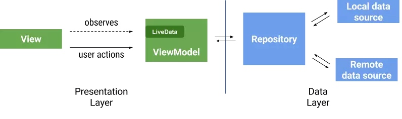

# Android 生命周期架构组件

本文介绍是使用的 `android.arch.lifecycle` 解决后台回调和 Android 生命周期产生的问题。

在 Android 开发过程中，Android 生命周期往往是发生内存泄漏和系统崩溃的地方。而 Google 方提供了 Lifecycle 包和运用它的 MVVM 框架。

## Google 的 MVVM 框架

理想情况下的 MVVM 框架，ViewModel 层不需要知道 View 层的任何细节，使ViewModel 的工作更加纯粹，而这样带来的好处是
* 减少 MVP 中直接使用 View 引用时出现的问题，如`getView().doSomething()` 在 View 销毁时的奔溃
* 更容易测试
* 有利于模块化



为了保证 ViewModel 的纯粹性（数据处理 + 逻辑处理），View 和 ViewModel 之间应该只有的两种交互

1. View 将用户事件交付 ViewModel
2. View 观察 ViewModel 数据的修改并进行 UI 操作

###  ViewModel 和 LiveData

我们在 Google 的 MVVM Example 中看到 ViewModel 和 LiveData 的使用，MutableLiveData 是 LiveData 一个实现类。
### 
```java
// UserProfileViewModel
public class UserProfileViewModel extends ViewModel {
    // 储存用户数据的LiveData
    public final LiveData<List<UserProfileEntity>> mLiveUserProfiles = new MutableLiveData<>();
    // 打开用户详情的点击事件
    public final LiveData<String> mLiveOpenEvent = new MutableLiveData<>();
    // 虚造的 Repository
    private final FakerRepository mFakerRepository = new FakerRepository(this);

    public void loadUserProfiles() {
        mFakerRepository.loadUserProfiles();
    }
}
```
在 Activity 中，通过 `LiveData` 的 `observe(@NonNull LifecycleOwner owner, @NonNull Observer<T> observer)` 方法，对数据修改和事件进行回调。

```java
// UserProfileActivity
protected void onCreate(Bundle savedInstanceState) {
    ...
    // Subscribe to update UI
mViewModel.mLiveUserProfiles.observe(this, userProfileEntities -> {
        if (userProfileEntities != null) {
            userProfileAdapter.getData().clear();
            userProfileAdapter.getData().addAll(userProfileEntities);
            userProfileAdapter.notifyDataSetChanged();
        }
    });
    
    // Subscribe to "open profile detail" event
    mViewModel.mLiveOpenEvent.observe(this, userId -> openProfileDetail(userId));

}

protected void openProfileDetail(String userId) {
    Intent intent = new Intent(this, ProfileDetailActivity.class);
    startActivity(intent);
    finish();
}
```
最后在调用 LiveData 的 `postValue(T value)` 或`setValue(T value)` 赋值时，就可以触发对应的 Observe 回调。其中 `setValue(T value)` 用于主线程，`postValue(T value)` 可以用在子线程。

## LiveData 是普通的 KVO 吗？

监听一个数据的变化，并根据它的值做对应的处理，LiveData 的用法和 KVO（Key-Value Observe) 的思想完全一致。那 LiveData 就是普通的 KVO 吗？我们查看 LiveData 的 `observe` 方法的源码，可以知道，使用 obsever 方法会往 mObservers 中添加 obsever 和 obsever 的包装类。
```java
// 用于存储 Observer 和它的包装类的 map
// SafeIterableMap 遍历安全的 Map，可以在遍历过程中删除某个元素
private SafeIterableMap<Observer<T>, ObserverWrapper> mObservers =
            new SafeIterableMap<>();

@MainThread
public void observe(@NonNull LifecycleOwner owner, @NonNull Observer<T> observer) {
    // 如果 owner 的生命周期是 DESTROYED（销毁）状态，直接返回
    if (owner.getLifecycle().getCurrentState() == DESTROYED) {
        // ignore
        return;
    }
    // 根据这个 owner 和 observer 新建一个 wrapper
    LifecycleBoundObserver wrapper = new LifecycleBoundObserver(owner, observer);
    // putIfAbsent 在 map 已经存在这个key的时候返回对应的 value，否者正常添加
    ObserverWrapper existing = mObservers.putIfAbsent(observer, wrapper);
    if (existing != null && !existing.isAttachedTo(owner)) {
        throw new IllegalArgumentExceptaion("Cannot add the same observer"
                + " with different lifecycles");
    }
    if (existing != null) {
        return;
    }
    //注册监听事件
    owner.getLifecycle().addObserver(wrapper);
}
```

而这个包装类时做什么的呢？
* `ObserverWrapper` 封装了 Observer 是否存活这个状态，并提供了一个修改存活状态的方法
* `LifecycleBoundObserver` 这个包装类会根据监听 owner 的生命周期修改 Observer 的存活状态。当 owner 被销毁时，这条数据也会被移出 mObservers

```java
// Observer 的包装类，标记每个 Observer 是否存活
private abstract class ObserverWrapper {
    final Observer<T> mObserver;
    boolean mActive; // 是否存活
    int mLastVersion = START_VERSION; // 每次回调后修改 Version 的值
    ...
    // 修改 mActive 状态
    void activeStateChanged(boolean newActive) {...}
}
// ObserverWrapper 的实现类，并且能在 owner 生命周期变化而作出对应操作
class LifecycleBoundObserver extends ObserverWrapper implements GenericLifecycleObserver {
    @NonNull final LifecycleOwner mOwner;
    ... 
    boolean shouldBeActive() {...}//根据 owner 的状态判断是否存活
    @Override
    public void onStateChanged(LifecycleOwner source, Lifecycle.Event event) {
        if (mOwner.getLifecycle().getCurrentState() == DESTROYED) {
            removeObserver(mObserver); // 从mapper 中移除这 observer
            return;
        }
        activeStateChanged(shouldBeActive());
    }
}
```

在调用 setValue 时，将遍历 mObservers 所有 value，并通过 `considerNotify` 最后进行一波校验

```java
 private void considerNotify(ObserverWrapper observer) {
        if (!observer.mActive) {
            return;
        }
        // Check latest state b4 dispatch. Maybe it changed state but we didn't get the event yet.
        //
        // we still first check observer.active to keep it as the entrance for events. So even if
        // the observer moved to an active state, if we've not received that event, we better not
        // notify for a more predictable notification order.
        // 该方法再次调用 owner 的判断是是否能重新进入激活状态
        if (!observer.shouldBeActive()) {
            observer.activeStateChanged(false);
            return;
        }
        // 如果有已经 observe 了新的值则不响应旧的值
        if (observer.mLastVersion >= mVersion) {
            return;
        }
        observer.mLastVersion = mVersion;
        //noinspection unchecked
        observer.mObserver.onChanged((T) mData);
    }
```
可以看到，LiveData 之所以变得 Live，是在它注册的 Observer 的同时，通过包装 Observer 的方法，做到根据生命周期感知决定该 Observer 的有效性和是否保留该 Observer的 功能。确保了它只会更新处于活跃状态 Activity/Fragment 组件。


#### 疑问

```java
owner.getLifecycle().addObserver(wrapper);
```

这句代码中，是 `ObserverWrapper` 能够根据Activity/Fragment 生命周期来修改自身状态的关键。而这句话仍然存在疑问：

* Owner 是什么？
* Lifecycle 是什么？
* LifecycleBoundObserver 实现的 LifecycleObserver 是什么？


### 生命周期完整过程

LifeCycle 组件是用来监听 Activity/Fragment 的生命周期变化的组件。
* 在生命周期拥有者与生命周期的观察者之间快速方便的建立一种联系。在生命周期拥有者的生命周期变化时，观察者会收到对应的通知。


1. LifecycleOwner 是一个接口，它只包含 getLifecycle() 方法。本质上就是为了抽象出 Activity/Fragment 生命周期所有权的这个概念。

1. LifeCycle 抽象出 Activity/Fragment 的生命周期，并声明了与 LifecycleObserver 的关联操作。而如何注册和调用Observer 的细节在LifecycleRegistry 内部实现

1. LifecycleObserver 是一个内部为空的接口，继承的类将监听生命周期修改并作出对应操作

#### LifeCycle
LifeCycle 核心部分就是它的七个 Event 和五个 State，Event 是对 Android 组件（Activity 或 Fragment）生命周期函数的映射。Framework 回调生命周期函数时，如果 state 发生变化，则会通知 LifecycleObserver 响应执行某些操作


它除了获取 State 的方法以外，还可以为其添加对应的LifecycleObserver，我们之前调用 
`owner.getLifecycle().addObserver(wrapper)`
就是通过这个方法。

*  addObserver(@NonNull LifecycleObserver observer)
*  removeObserver(@NonNull LifecycleObserver observer)


## 值得思考的点

本文以 LiveData 作为切入点，介绍了 LiveData 的如何通过生命周期组件实现根据 Activity/Fragment 的生命周期来判断是否回调 Observer。在研究本文的时候，也发现了MVVM 的一些问题
#### MVVM 存在的问题
* 所有事件都需要通过 LiveData 来操作，把简单的业务变得繁琐。  
    3. 在 BaseActivity 和 BaseViewModel 中实现这些操作
    4. 使用 DataBinding 控制一些简单的 UI 操作，如Hud 的现实和消失
* ViewModel 常被容器持有后，ViewModel 之间可能内存泄漏 Repository
    1. 在没有 ` ViewModel.onCleared()` 通知 Repository 这个 ViewModel 马上要被清除
    2. 使用 WeakReference
    3. 使用 LiveData 来关联 Repository 与 ViewModel

#### 值得学习的地方：

了解了 Android 生命周期组件的工作机制，任何 MV - Any （ Model + View + Any) 的框架都可以实现直接的 `LifecycleObserve`，来应对 Activity/Fragment 的生命周期的变化。

#### 更多：

Activity 和 Fragment 都是使用  `LifecycleRegistry` 来管理自身生命周期与 `LifeCycle` 的同步，和通知 `LifecycleObserve`做出相应的操作， `LifecycleRegistry` 它的实现也值得一定的了解。


#### 引用

> 谷歌框架案例 
> https://github.com/googlesamples/android-architecture
> ViewModel 和 LiveData 
> https://juejin.im/post/5a040585f265da43346f5d57#heading-9
> Android 生命周期架构组件
> https://listenzz.github.io/android-lifecyle-works-perfectly-with-rxjava.htmlml*ml*l**