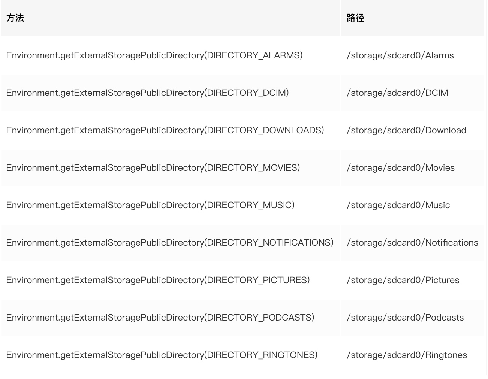

# Android 数据持久化
在 Android 中数据持久化的方式有以下几种。
1. SQLite
    2. SQLiteOpenHelper
2. ContentProvider
3. File 
    1. InternalStorage
    2. ExternalStorage
4. SharedPreferences

## SQLite

### SQLiteOpenHelper 的使用
> [官方文档](https://developer.android.com/reference/android/database/sqlite/SQLiteOpenHelper)
> [SQLiteOpenHelper 详细解析](https://blog.csdn.net/carson_ho/article/details/53241633)
> [使用 SQLiteOpenHelper 的正确姿势](https://juejin.im/entry/595ce51df265da6c2a747ca0)
> [查看当前数据库的工具](https://github.com/amitshekhariitbhu/Android-Debug-Database)

关于 SQLiteOpenHelper 介绍的 blog 已经太多了，在这里我尽量多去编程学习，而不是再复述一遍别人说过的话。

总的来说，SQLiteOpenHelper 就是一个Android 原生的 SQLite 数据库操作类，里面包含了 数据库创建，数据库升级。并且可以通过 `getReadableDatabase`（只读） 和 `getWritableDatabase`（读写） 方法获取数据库对象进行CURD。

如今我们用的更多的是 GreenDao, LitePal 等第三方框架来进行数据库操作。这些三方库本质上就是对 SQLiteOpenHelper 的封装。

### ContentProvider -- 最熟悉的陌生人
ContentProvider 作为 Android 四大组件之一，但对我来说算是最陌生的一个。原因是 ContentProvider 用于进程间的通讯，而同样的功能在公司的项目中往往是用 socket 和 udp 实现的。接下来就记录一些相关的知识

#### ContentProvider 的介绍
> [官方文档](https://developer.android.com/reference/android/content/ContentProvider.html)

ContentProvider 是一种内容共享型的组件。本质上是一块数据（以 database，xml 等方式存储的数据），通过 ContentProvider 这层抽象的容器，提供 CURD 的方法，达到跨进程通讯的目的。

官方提供了以下的方法：
* onCreate() which is called to initialize the provider
* query(Uri, String[], Bundle, CancellationSignal) which returns data to the caller
* insert(Uri, ContentValues) which inserts new data into the content provider
* update(Uri, ContentValues, String, String[]) which updates existing data in the content provider
* delete(Uri, String, String[]) which deletes data from the content provider
* getType(Uri) which returns the MIME type of data in the content provider

在我们自定义的类继承 `ContentProvider` 后，实现这些方法。并在 AndroidManifest 中注册该类。即可以被其他应用访问了。

#### 数据操作离不开 ContentResolver

`ContentResolver` 根据不同 `ContentProvider` 的 URI，来找到对应的 `ContentProvider`，并进行CURD的操作。
我们拿一个获取通讯录信息作为例子：

```java
public fun getContactList(): List<String> {
        val contacts = ArrayList<String>()
        val projection = arrayOf(ContactsContract.Contacts._ID, ContactsContract.Contacts.DISPLAY_NAME)
        val query = ContextUtils.getContext()?.contentResolver?.query(ContactsContract.Contacts.CONTENT_URI, projection, null, null, null)
                ?: return contacts
        while (query.isLast) {
            contacts.add(query.getString(PHONES_NUMBER_INDEX))
            query.moveToNext()
        }
        query.close()
        return contacts
    }
```
## Android 文件系统

### 内部存储

在安装一个应用的同时，会在 data/data 目录下创建一个与包名对应的文件夹。默认情况下，保存到内部存储的文件是应用的私有文件，其他应用（和用户）不能访问这些文件。 当用户卸载您的应用时，这些文件也会被移除。


* `getFilesDir()` 获取在其中存储内部文件的文件系统目录的绝对路径。
* `getDir()` 在您的内部存储空间内创建（或打开现有的）目录。
* `deleteFile()` 删除保存在内部存储的文件。
* `fileList()` 返回您的应用当前保存的一系列文件。

### 外部存储

#### 获取外部存储的访问权限
要读取或写入外部存储上的文件，您的应用必须获取 READ_EXTERNAL_STORAGE 或 WRITE_EXTERNAL_STORAGE 系统权限。

```xml
<manifest ...>
    <uses-permission android:name="android.permission.WRITE_EXTERNAL_STORAGE" />
    ...
</manifest>
```

判断是否拥有访问权限

```java
/* Checks if external storage is available for read and write */
public boolean isExternalStorageWritable() {
    String state = Environment.getExternalStorageState();
    if (Environment.MEDIA_MOUNTED.equals(state)) {
        return true;
    }
    return false;
}

/* Checks if external storage is available to at least read */
public boolean isExternalStorageReadable() {
    String state = Environment.getExternalStorageState();
    if (Environment.MEDIA_MOUNTED.equals(state) ||
        Environment.MEDIA_MOUNTED_READ_ONLY.equals(state)) {
        return true;
    }
    return false;
}
```

获取路径方式`Environment.getExternalStorageDirectory()`
 （即路径/storage/sdcard0）



## SharedPreferences

> [SharedPreferences的理解与使用](https://juejin.im/post/5adc444df265da0b886d00bc)
> [面试高频题：一眼看穿 SharedPreferences](https://juejin.im/post/5c34615bf265da614171bf8a) 


SharedPreferences 也是我们常用的数据持久化方法之一，这里就不多赘述了，直接上代码。

```kotlin

object SpUtils {

    private const val FILE_DEFAULT_NAME = "DefaultPreference"

    @JvmStatic
    public fun getSharedPreferences(): SharedPreferences? {
        return ContextUtils.getContext()?.getSharedPreferences(FILE_DEFAULT_NAME, Context.MODE_PRIVATE)
    }

    @JvmStatic
    public fun getSharedPreferences(fileName: String): SharedPreferences? {
        return ContextUtils.getContext()?.getSharedPreferences(fileName, Context.MODE_PRIVATE)
    }

    @JvmStatic
    public fun put(sharedPreferences: SharedPreferences?, key: String, value: Any) {
        var edit = sharedPreferences?.edit()
        when (value) {
            is Int -> edit?.putInt(key, value)
            is String -> edit?.putString(key, value)
            is Boolean -> edit?.putBoolean(key, value)
            is Float, is Double -> edit?.putFloat(key, value as Float)
            is Long -> edit?.putLong(key, value)
        }
        edit?.apply()
    }

    @JvmStatic
    fun contains(sharedPreferences: SharedPreferences?, key: String): Boolean {
        return sharedPreferences?.contains(key) == true
    }

    @JvmStatic
    @Suppress("UNCHECKED_CAST")
    fun <T> get(sharedPreferences: SharedPreferences?, key: String, defaultValue: T): T {
        if (!contains(sharedPreferences, key)) return defaultValue
        when (defaultValue) {
            is Int -> return sharedPreferences?.getInt(key, defaultValue) as T
            is String -> return sharedPreferences?.getString(key, defaultValue) as T
            is Boolean -> return sharedPreferences?.getBoolean(key, defaultValue) as T
            is Float -> return sharedPreferences?.getFloat(key, defaultValue) as T
            is Long -> return sharedPreferences?.getLong(key, defaultValue) as T
        }
        return defaultValue
    }
}
```