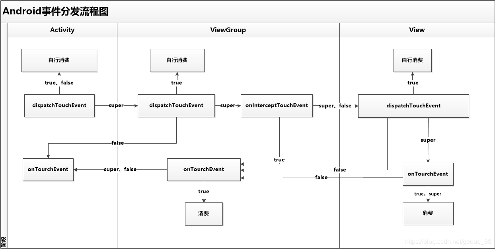

# Android 事件分发流程
知识点：事件序列指以 `ACTION_DOWN`为开始，`ACTION_UP`为结束，`ACTION_MOVE`为中间过程。
## 分发
dispatchTouchEvent 方法负责事件的分发，根据返回值来决定是否将事件分发给谁处理。
分发的流程是： Activity -> ViewGroup -> View

* dispatchTouchEvent 在 ViewGroup 中返回值是：
    * `true`：事件的分发在此结束，也不会调用自身的 onTouchEvent
    * `false`：不再继续向下分发，事件传回给父类的 onTouchEvent
    * `super.dispatchTouchEvent` : 正常分发

    在 ViewGroup 中，正常的分发也不是马上将事件交付给子View，而是走接着走事件的拦截流程。

## 拦截
onInterceptTouchEvent 方法负责事件的拦截，根据返回值的不同来判断事件由自身处理还是子View处理，即是否拦截。

* 在 ViewGroup 中返回值是：
    * `true`：拦截，由本身的 onTouchEvent 去消费事件
    * `false`，`super.onInterceptTouchEvent` ：不拦截，继续下发给子 View。

在一层一层的 ViewGroup 中，事件由最高层的 ViewGroup（通常是Activity）逐步分发到下层。而每一层都能重写 `dispatchTouchEvent` 方法和 `onInterceptTouchEvent` 方法去决定是否继续分发，还是在当前 ViewGroup 消费，亦或是由上层消费。

>> 当拦截了一个事件之后（如 `ACTION_DOWN`），这个事件的序列（`ACTION_DOWN`为开始，`ACTION_UP`为结束）都只能由该
ViewGroup 消费，不会再调用 `onInterceptTouchEvent` 判断是否需要被拦截。

## 消费

onTouchEvent 负责事件的消费，重写这个方法来根据事件的不同，作出对应的操作。同时，根据放回值的不同，可以决定是否回传给父 View 消费。

* 在 ViewGroup 中返回值是：
    * `true`：消费完成，事件的传递到此结束
    * `false`，`super.onTouchEvent` ：传回给父 View 消费。
    
至此，ViewGroup 的事件分发流程已经走通了，可以看出事件分发的终点有两个。一个是被取消分发*（dispatchTouchEvent 返回为 true）* ，另一个就是被消费。

View 和 ViewGroup 最大的区别是，View 是没有子 View 的，所以他没有拦截的过程，而且更偏向去消费事件，而不是分发事件。
## View 的分发和消费
和 ViewGroup 相比的，View 更偏向于自身去消费事件。
### 分发
* dispatchTouchEvent 在 ViewGroup 中返回值是：
    * `true`：事件的分发在此结束，也不会调用自身的 onTouchEvent
    * `false`：不再继续向下分发，事件传回给父类的 onTouchEvent
    * `super.dispatchTouchEvent`：调用自身的 onTouchEvent 去消费
    * 
### 消费
* onTouchEvent 在 View 中返回值是：
    * `true`，`super.onTouchEvent`：消费完成，事件的传递到此结束
    * `false` ：传回给父 View 消费。

>> 另外如果当前 View 没消费过 `ACTION_DOWN` 事件的话，那么 之后的`ACTION_MOVE`和`ACTION_UP`事件都与该 View 无关****

最后上一张流程图：

### 引用
https://blog.csdn.net/qian520ao/article/details/77429593