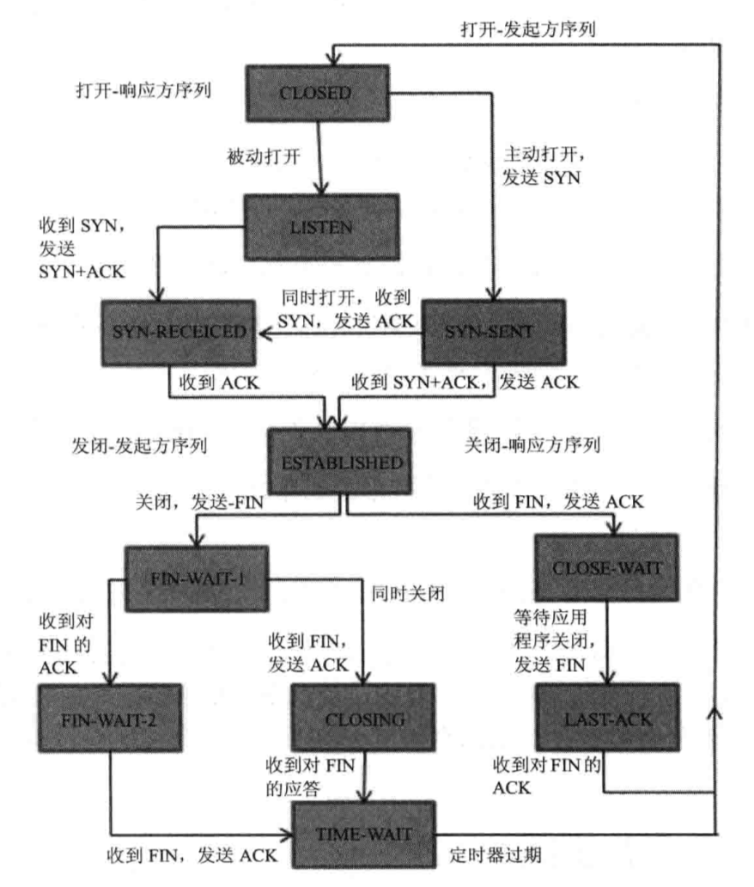

# TCP 看完一遍又一遍

## TCP 状态

1. `CLOSED`：起始点，在超时或者连接关闭时进入此状态。
2. `LISTEN`：Server 端在等待连接时的状态，Server 端为此调用 Socket、bind、listen 状态。
3. `SYN-SENT`：客户端发起连接，发给送SYN 给服务器端。如果服务器端不能连接，则直接进入 CLOSED 状态。
4. `SYN-RCVD`：对应3，服务器端接受客户端的 SYN 请求，服务器端由 LISTEN 进入 SYN_RCVD，同时服务器回应一个 ACK 包，并发送一个 SYN 包给客户端；另外一种情况。客户端在发起 SYN 的同时接收服务端的 SYN 请求，客户端会由 SYN-SENT 转换到 SYN-RCVD 状态。
5. `ESTABLISHED`：服务器端和客户端在完成 3 次握手后进入ESTABLISHED，说明可以开始传输数据了。
6. `FIN-WAIT-1`：主动关闭的一方，由状态 5 进入此状态，发送 FIN 给对方。
7. `FIN-WAIT-2`：主动关闭的一方，接受对方 FIN 和 ACK，进入该状态，由此不在接受对方数据，但能向对方发送数据。
8. `CLOSE-WAIT`：接收到 FIN 的同时发送 ACK，被动关闭的一方进入该状态。
9. `LAST-ACK`：被动关闭的一方，发送 FIN 包给对方，由状态 8 进入此状态。
10. `CLOSEING`：两边同时发送关闭请求时，会由 FIN-WAIT-1进入该状态。具体动作 FIN 请求，同时响应一个 ACK。
11. `TIME-WAIT`：这个状态比较复杂，也是最常见的一个连接状态。
	1. 由 `FIN-WAIT-2` 转换到 `TIME-WAIT`，在双方不同时发起 FIN 时，主动关闭的一方在完成自身请求后，接收到被动关闭方 FIN 包后进入该状态。
	2. 由 `CLOSING` 转换到 `TIME-WAIT`，具体情况是：在双方同时发起关闭，都发送 FIN 包后，同时接收了 FIN 并做了 ACK 的情况后，会由 CLOSING 进入到 `TIME-WAIT`状态。
	3. `FIN-WAIT-1` 转换到 `TIME-WAIT`，同时接收到 FIN（对方发起的） 和 ACK（本身发起的 FIN 回应），它与 `CLOSING` 转换到 `TIME-WAIT` 则是 FIN 达到。

### 三次握手（3个 TCP 包的交换）
1. Client 发送请求包首部同步位 SYN = 1，选择序号为 seq = x，而 SYN 包不能携带数据，但需要消耗一个序号，进入 SYN-SEND 状态。
2. Server 在确认包把 SYN 和 ACK 都标记为 1，首部的确认号为 ack = x + 1，选择序号为 seq = y，同样的作为 SYN 包不能携带数据，但需要消耗一个序号，这时 Server 进入 SYN-RCVD 状态。
3. Client 收到确认包，还需要想 Server 发送确认包。确认包的 ACK 位置 1，确认号为 y + 1。而 ACK 包是可以携带数据的，如果不携带数据时，该包不需要消耗序列号。这时 Client 进入 ESTABLISHED。
而在 Server 接受到这个确认包时，也进入 ESTABLISHED 状态。

* 为什么不能是二次握手？
**防止 “已失效的连接请求报文”。**
在 Client 第一次发送同步请求（SYN 包），而网络状态导致延迟到达 Server。而 Server 在接受到 SYN 包后会回复确认包之后，Clinet 就进入
ESTABLISHED 状态。但如果这个时间点 Client 如果不在 SYN-SEND 状态，则不会进入当前ESTABLISHED，这时候 Server 会傻傻的等待对方的数据而浪费了大量的资源。所以需要最后一次 Client 向 Server 发送 ACK 包，而 Server  在接受ACK 包之后再进入 ESTABLISHED。
* 4次握手是什么？
在 Server 接受SYN 包时，先发送一个确认包 ACK = 1 确认码ack = x + 1 ，
然后再发送一个 SYN 包 SYN = 1，序号 seq = y 。但这一过程和 3 次握手的效果是一样的。

### 4次挥手（4次 TCP 包的交换）
1. A 端连接释放包把首部 FIN 位置 1，序号 seq = u，而 FIN 包即使不携带数据，它也会消耗掉一个序号。而A 进入 FIN-WAIT-1。
2.  B 端收到 FIN 包后， 表示自己已经没有数据发送给 B 了，但 B 还可能有数据给 A，所以接下来会是单方向的消息发送。
	1. B 在 ESTABLISHED 状态，如果 B 还有数据要发送，则发送确认包 ack = u + 1，进入CLOSE-WAIT 状态。
	2. B 在 ESTABLISHED 状态，但没有数据要发送，则确认包 ack = u + 1，并标志 FIN = 1，进入 LAST-ACK。
	3. B 已经是 FIN-WAIT-1 状态，这时候收到 FIN 包，则回复它的 ACK 包，则进入 CLOSING。
3. 
	1. 对应2.1状态，A 端在接受到 B 端的 ACK 包后则进入FIN-WAIT-2。等待对方的 FIN 包
	2. 对应2.2状态，A 端在接受 ACK+FIN 包后进入 TIME-WAIT 状态。回复 ACK 包。
	3. 对应2.3状态，A 端在接受 ACK 前接受到 FIN，进入 CLOSING 状态。回复 ACK 包。
4. 对应 3.1 的情况，B 端在没有数据要传输后，在报文头部标志 FIN = 1，还需要再次将ACK 标位 1， ack = u + 1 ，发送 FIN 包后进入LAST-ACK 状态。
5. 对应4，A 端回复 ACK 包，并进入 TIME-WAIT 状态。而 B 端接受到 ACK 包后，进入 CLOSED。

### 时间等待计数器（TIME-WAIT timer)
TCP进入 TIME-WAIT 后，并没有真正关闭 TCP 连接，而是要经过 timer 设置的时间后再关闭连接。
1. 保证 A 发送的最后一个 ACK 报文能到达 B。
2. 防止“已失效的连接请求包”。