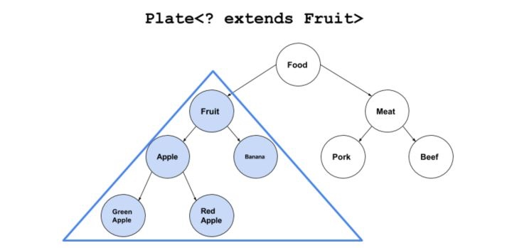

# Java class 与泛型

### 泛化的 Class 引用

我们由一段代码来切入今天的主题：
``` java
public class Demo {
    
    public static void main(String[] args) {
        try{
            Class<? extends Number> numClass = int.class;
            numClass = double.class;
            numClass = Integer.class;
        } catch(Exception e){
            e.printStackTrace();
        }
    }

}
```
上述代码没有任何的实际意义，但是能引出以下两个问题：
1）Class 是什么类？
2）泛型有什么作用？
对于这两个问题，我们的解答是：

1. Class 的功能与使用

    * `Class` 类：`Class` 引用总是指向某个类的 `Class` 对象。`Class` 类可以用于制造类的实例，并包含可作用于这些实例的所有方法代码，并且包含该类的静态成员。
    * `Class<?>` 与 `Class` 是等效的，但是使用 `Class<?>` 的好处是表示你并不是由于疏忽而未指定具体的类引用，而是选择了非具体的版本。
    
2.  使用带泛型的 Class 引用的好处：
    * 使用 `Class<?>` 调用 `getInstanse()` 方法获取到的对象是 Object 类型的实例。但如果使用 `Class<Integer>` 则是 Integer 类型的。

所以 Class 类包含了其他类的类型信息。可用于制造类的实例和查看类的成员和方法。

### 泛型通配符 extends 和 super
* 为了引入通配符？
 Java 中 `Integer` 类继承于 `Number` 类，但 `Integer.class` 并不是 `Number.class` 的子类 （~~objc比这优雅多了~~），所以 `Class<Number> numClass = Integer.class;` 是不合法的。
 
#### extends 上界通配符

因为以上尴尬的情况，所以引入了 `? extends` 通配符声明 这个class 引用是用来引用继承于 `Number` 的子类 class 对象。所以才能将 `Integer.class` 赋值给它。
我们以下图为例子：


`<? extends Fruit>` 该类的`set()`方法失效。但取东西`get()`方法还有效。
```java
Plate < ? extends Fruit > p = new Plate < Apple > (new Apple()); //不能存入任何元素
p.set(new Fruit());    //Error
p.set(new Apple());    //Error
```
#### super 下界通配符

声明了`? super Frult`的泛型对象，能存放当前类型和它所有父类的对象。


与 `extends` 相反，`super` 通配符会使`get()`方法失效，但是`set()`方法仍让有效。

### cast 方法
使用 `cast()` 可以对无法强制转换的实例进行转换。

```java
public class Demo {
    
    public static void main(String[] args) {
        try{
            Number a = 1;
            Class<Integer> numClass = Integer.class;
            Integer i = numClass.cast(a);
            System.out.println(i);
        } catch(Exception e){
            e.printStackTrace();
        }
    }
}
```


### 泛型擦除
* 我们在使用泛型的过程中，常常因为无法获取泛型 T 的 class 引用。
是因为编译期在擦除后无法得知对象 T 的类型，但编译器还是能保证最为返回值时仍然具有 T 类型。因为擦除在运行的边界（进入和离开的地方），编译器执行了类型检查并插入了转型代码。

``` java
public class Demo<T> {
    private T obj;
    public void set(T obj){
        this.obj = obj;
    }  
    public T get(){
        return this.obj;
    }
    public static void main(String[] args) {
        Demo<String> demo = new Demo<String>();
        demo.set("123");
        String str = demo.get(); // 等效于 (String) demo.get()，获取到 Object 类型后强转为 String 类型
        System.out.println(str);
    }
}

    Code:
       0: new           #3                  // class Demo
       3: dup
       4: invokespecial #4                  // Method "<init>":()V
       7: astore_1
       8: aload_1
       9: ldc           #5                  // String 123
      11: invokevirtual #6                  // Method set:(Ljava/lang/Object;)V
      14: aload_1
      15: o #7                  // Method get:()Ljava/lang/Object;
      18: checkcast     #8                  // class java/lang/String
      21: astore_2
      22: getstatic     #9                  // Field java/lang/System.out:Ljava/io/PrintStream;
      25: aload_2
      26: invokevirtual #10                 // Method java/io/PrintStream.println:(Ljava/lang/String;)V
      29: return
```

